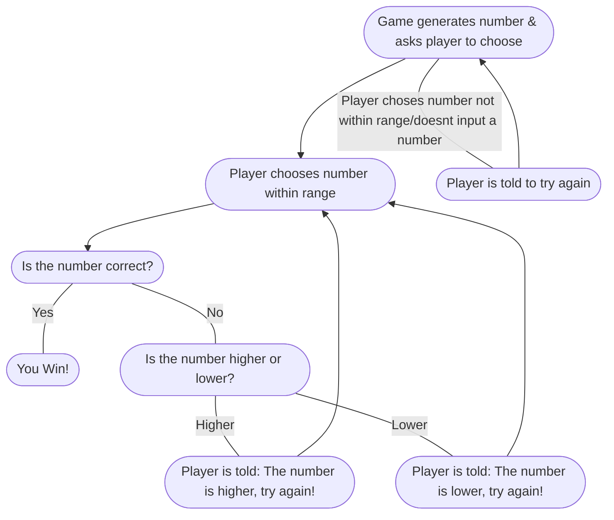

The guessing game follows a step by step process. First, the game generates a number randomly for the player to guess. The player is then prompted to choose a number within a specified range. If they input something that is not within the range, or something that is not a number, they are told to try again. If they select a number within the range, the game then determines if they are correct or not. If they are, they have won the game. If they are not, they are told that the number is either higher or lower, and to try again until they've guessed the correct number. 
